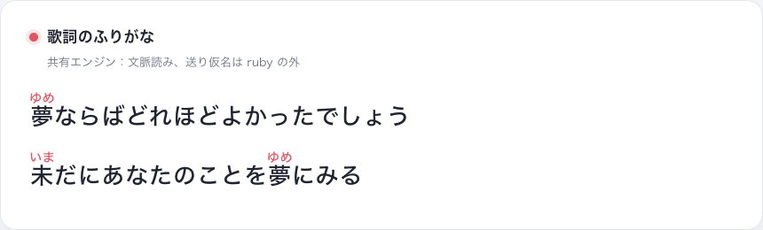
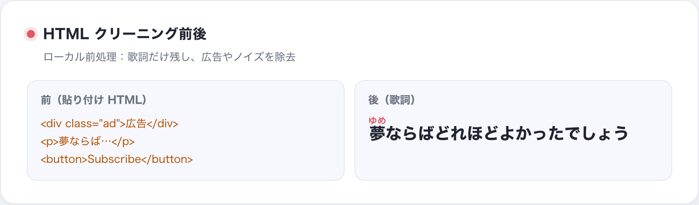
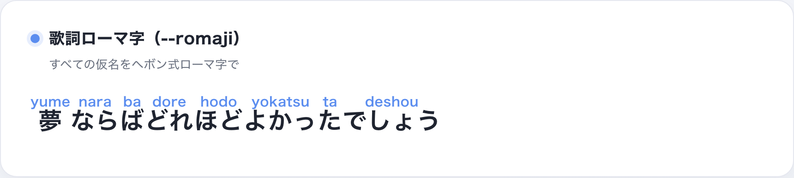
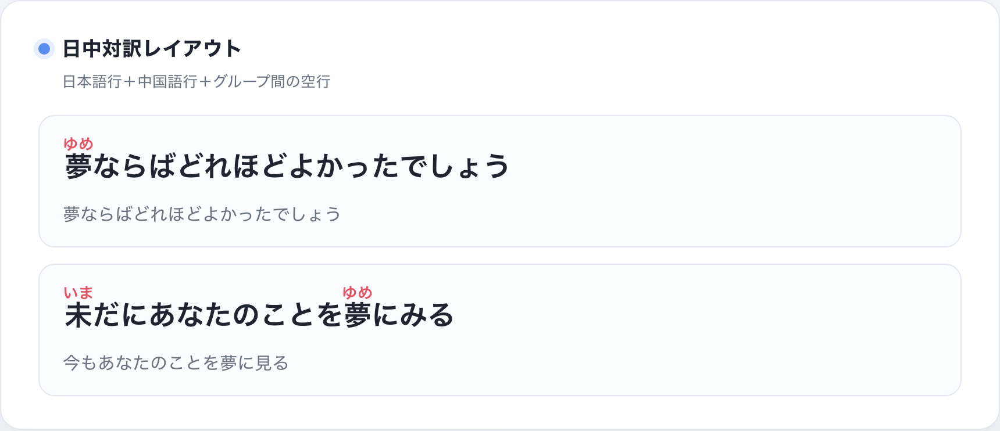
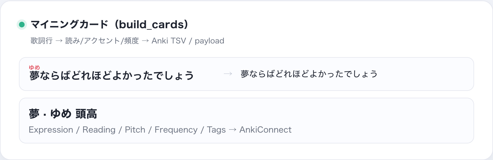
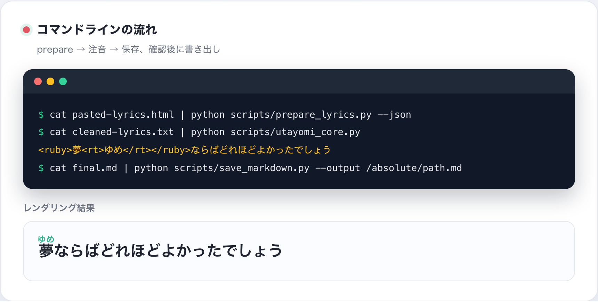
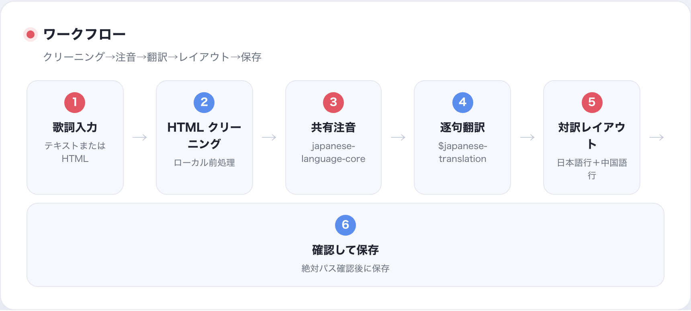

# Utayomi

Agent 向けの**日本語歌詞ふりがなスキル**です：ユーザーが貼り付けた歌詞を
ローカルでクリーニングし、共有エンジンで文脈付きの `<ruby>` ふりがな
（平仮名・ローマ字）を付け、各行に中国語訳を並べ、絶対パスを確認してから
Markdown を保存します。

## 解決する問題

歌詞は汚れています：貼り付けたページには HTML・広告・ノイズが混ざり、
読みは文脈依存で、ファイルの書き出しや上書きは事故の元です。Utayomi は
すべてローカルかつ決定的に処理し、注音結果に一つの契約を持ちます。

## こだわっている点

- **原文保証**：すべての token の `orig` が入力を再構成する。
- **文脈読み**：`japanese-language-core`（Sudachi 優先、PyKakasi フォールバック）。
- **送り仮名**：かなは ruby の外（`踏み込む`・`歌う` を丸ごと包まない）。
- **辞書は証拠**：Yomitan/JMdict は候補と監査情報を提供し、エンジンを
  静かに上書きしない。
- **審査済みルール**：各上書きに ID・理由・テストがある。
- **出力検証**：共有契約と回帰テストで原文と ruby の整合を確認。
- **ファイル安全**：CLI は既定で出力のみ。書き出しは確認済み絶対パスのみ。

## 実際の例

入力：

```text
雨が降り止むまでは帰れない
```

共有エンジンと審査済みルールの出力：

```html
<ruby>雨<rt>あめ</rt></ruby>が<ruby>降<rt>ふ</rt></ruby>り<ruby>止<rt>や</rt></ruby>むまでは<ruby>帰<rt>かえ</rt></ruby>れない
```

`降り止む` は文字単位の推測ではなく文脈読みです。このサンプルは共有エンジンの
契約テストに含まれています。

## プレビュー

GitHub の README は `<ruby>` を描画しないため、実際の出力を画像で示します。

<p align="center">
  
  <br><sub>歌詞ふりがな：文脈読み、送り仮名は ruby の外</sub>
</p>

<p align="center">
  
  <br><sub>HTML クリーニング：歌詞だけ残し、広告やノイズを除去</sub>
</p>

<p align="center">
  
  <br><sub>ローマ字モード（--romaji）：すべての仮名をヘボン式で</sub>
</p>

<p align="center">
  
  <br><sub>対訳レイアウト：日本語行＋中国語行＋グループ間の空行</sub>
</p>

<p align="center">
  
  <br><sub>マイニングカード（build_cards）：歌詞行 → 読み/アクセント/頻度 → Anki</sub>
</p>

<p align="center">
  
  <br><sub>CLI：prepare → 注音 → 保存、確認後に書き出し</sub>
</p>

<p align="center">
  
  <br><sub>歌詞入力 → HTML クリーニング → 共有注音 → 逐句翻訳 → 対訳レイアウト → 確認して保存</sub>
</p>

**中文版 / English 版**：同じ 7 枚が `screenshot/zh/` と `screenshot/en/` に
あります。テンプレートは `scripts/screenshot/showcase.html`。

## アプローチ：証拠・再現・反証可能性

「モデルが賢く見える」ことを品質の証明にしません：

1. **文脈優先**：形態素解析の後に読みを生成。Sudachi 既定、無ければフォールバック。
2. **証拠の階層**：Yomitan データは候補・意味・差分監査を提供。最終出力は
   文脈エンジンと審査済みルールが決定。
3. **再現可能なテスト**：ゴールデンサンプル・共有契約・CLI 回帰をオフラインで実行。
4. **既定で安全**：URL 取得なし、ランダム書き出しなし、無言の上書きなし。

## ワークフロー

### 入力整理

`prepare_lyrics.py` はユーザーが提供したテキストだけを扱います：HTML タグや
`script`/`style` を除去し、エンティティをデコードし、曲名・歌手を認識し、
繰り返し・括弧・ハーモニーマーカー・改行を保持します。URL から歌詞は取得しません。

### 注音エンジン

`japanese-language-core` の最小契約 `ReadingToken` を利用：

```python
from japanese_language_core.reading import create_engine

engine = create_engine("auto")
tokens = tuple(engine.tokens("雨が降り止む"))
assert "".join(token.orig for token in tokens) == "雨が降り止む"
```

モード：`auto`（Sudachi 優先）、`shared`（厳格、CI 用）、`legacy`（互換）。
歌詞クリーニング・翻訳・タイトル判定・Markdown レイアウトは Utayomi の製品層です。

## コア機能

- **平仮名ふりがな**：`<ruby>漢字<rt>かんじ</rt></ruby>`。
- **ローマ字モード**：`--romaji`。
- **文脈読み**：共有 `japanese-language-core`。
- **送り仮名**：漢字とかなを分けて注音。
- **HTML クリーニング**：プレーンテキスト／貼り付け HTML。
- **対訳レイアウト**：日本語行の下に中国語行。
- **Agent 統合**：Codex スキル＋`PROMPT.md` フォールバック。
- **ローカル優先**：歌詞を外部送信しない。

## 使い方

### Agent モード

リポジトリ全体をスキルとしてインストールし、`$utayomi` を参照します。
スキルフレームワークがなければ `PROMPT.md` を使います。

### CLI モード

```bash
cat pasted-lyrics.html | .venv/bin/python scripts/prepare_lyrics.py --json
cat cleaned-lyrics.txt | .venv/bin/python scripts/utayomi_core.py
cat final.md | .venv/bin/python scripts/save_markdown.py --output /absolute/path.md
```

保存はユーザー確認済みの絶対パスのみ。`--create-parent` と `--overwrite` は明示指定。

## インストール

```bash
python3 -m venv .venv
.venv/bin/python -m pip install -r requirements.txt
```

`requirements.txt` は `japanese-language-core[reading]` を固定バージョンで参照します。

## 検証

```bash
PYTHONPATH=/path/to/japanese-language-core/src /path/to/python \
  -m unittest discover -s tests -v
```

現状：19/19 テスト成功、スキル構造検証成功、共有契約は `降り止む`・送り仮名・
legacy エスケープ・CLI 原文保持・`auto/shared/legacy` をカバー。共有境界の説明は
japanese-language-core リポジトリのドキュメントにあります。
