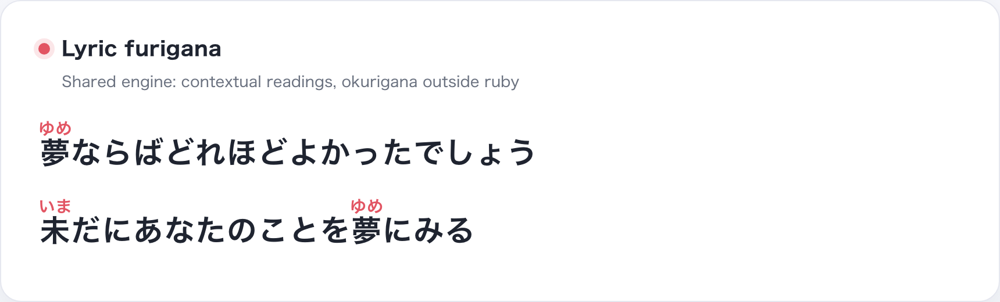
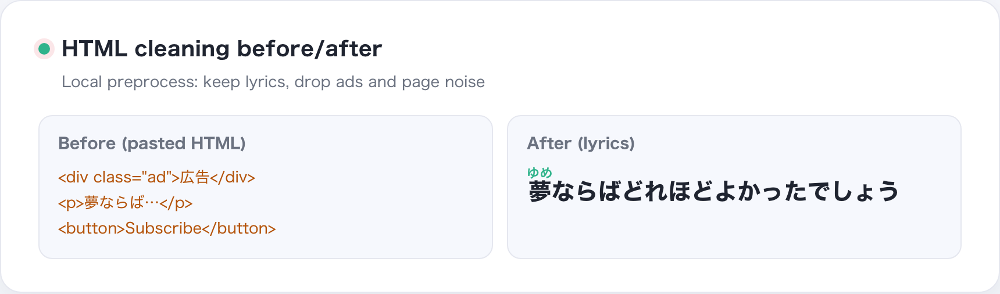
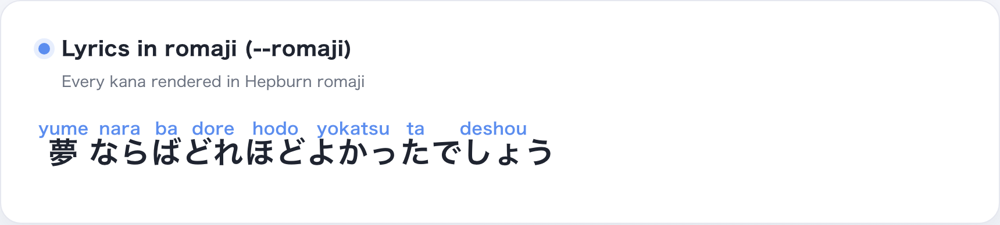
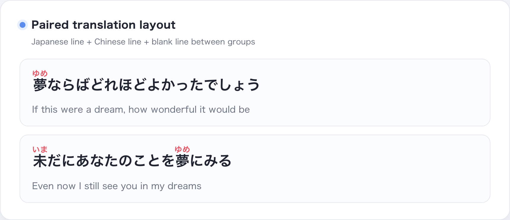
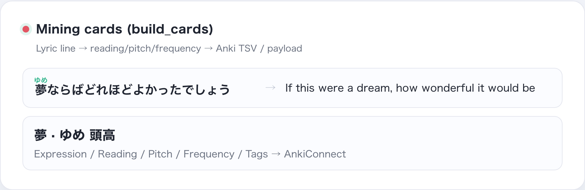
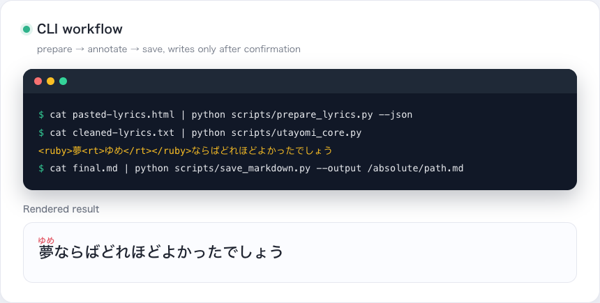
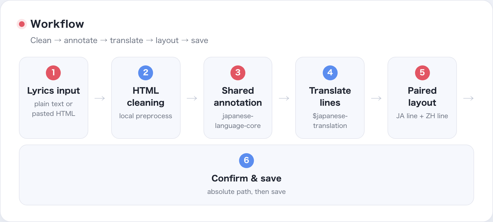

# Utayomi

An Agent-facing **Japanese lyric annotation skill**: it cleans user-pasted
lyrics locally, adds contextual `<ruby>` furigana (hiragana or romaji) with
the shared engine, pairs each line with a Chinese translation, and saves the
Markdown only after the user confirms an absolute path.

## What problem does it solve?

Lyrics are messy: pasted pages carry HTML, ads and menu noise; readings depend
on context; and files must not be written or overwritten by accident. Utayomi
keeps everything local and deterministic, with one contract for the annotated
output.

## Where the care shows

- **Source fidelity**: every token's `orig` must reconstruct the input.
- **Contextual readings**: `japanese-language-core` (Sudachi first, PyKakasi
  fallback).
- **Okurigana handling**: kana stays outside the ruby element
  (`踏み込む`, `歌う` are not wrapped whole).
- **Dictionary evidence**: Yomitan/JMdict data provides candidates and audit
  information without blindly overriding the engine.
- **Reviewed rules**: every override has an ID, a reason and a test sample.
- **Output validation**: shared contract + regression tests check source and
  ruby integrity; problems are reported, not hidden.
- **File safety**: the CLI only prints by default; writes require an explicit
  confirmed path.

## A real example

Input:

```text
雨が降り止むまでは帰れない
```

The shared engine and reviewed rules output:

```html
<ruby>雨<rt>あめ</rt></ruby>が<ruby>降<rt>ふ</rt></ruby>り<ruby>止<rt>や</rt></ruby>むまでは<ruby>帰<rt>かえ</rt></ruby>れない
```

`降り止む` uses a contextual reading instead of per-character guesses. This
sample is part of the shared engine's contract tests.

## Preview

GitHub's README does not render `<ruby>`; the images below show the real
annotated output.

<p align="center">
  
  <br><sub>Lyric furigana: contextual readings, okurigana outside ruby</sub>
</p>

<p align="center">
  
  <br><sub>HTML cleaning: keep lyrics, drop ads and page noise</sub>
</p>

<p align="center">
  
  <br><sub>Romaji mode (--romaji): every kana rendered in Hepburn romaji</sub>
</p>

<p align="center">
  
  <br><sub>Paired layout: Japanese line + Chinese line + blank line between groups</sub>
</p>

<p align="center">
  
  <br><sub>Mining cards (build_cards): lyric line → reading/pitch/frequency → Anki</sub>
</p>

<p align="center">
  
  <br><sub>CLI workflow: prepare → annotate → save, writes only after confirmation</sub>
</p>

<p align="center">
  
  <br><sub>Workflow: lyrics input → HTML cleaning → shared annotation → line-by-line translation → paired layout → confirm & save</sub>
</p>

**中文版 / 日本語版**: the same seven images live in `screenshot/zh/` and
`screenshot/ja/`; the generator template is `scripts/screenshot/showcase.html`.

## Engineering approach: evidence, reproduction, falsifiability

Utayomi treats Japanese processing as engineering, not as "the model looks
smart":

1. **Context first**: morphological analysis before readings; Sudachi by
   default, fallback only when unavailable.
2. **Evidence layers**: Yomitan data provides candidates, glosses and audit
   diffs; the final output is decided by the contextual engine and reviewed
   rules.
3. **Reproducible tests**: golden samples, shared-engine contract tests, and
   CLI regression tests are run locally without network.
4. **Safety by default**: no URL fetching, no random file writes, no silent
   overwrite.

## Workflow

### Input cleaning

`prepare_lyrics.py` only processes text the user provided:

- removes HTML tags, `script`, `style` and structural noise;
- decodes HTML entities;
- recognizes explicit song/artist metadata;
- keeps repeated lines, brackets, harmony markers and original line breaks;
- never fetches lyrics from a URL.

### Annotation engine

Utayomi consumes the minimal `ReadingToken` contract from
`japanese-language-core`:

```python
from japanese_language_core.reading import create_engine

engine = create_engine("auto")
tokens = tuple(engine.tokens("雨が降り止む"))
assert "".join(token.orig for token in tokens) == "雨が降り止む"
```

Engine modes: `auto` (Sudachi first), `shared` (strict, for CI), `legacy`
(compatibility fallback). Lyric cleaning, translation, title detection and
Markdown layout are Utayomi's own product layer.

## Core features

- **Hiragana furigana**: `<ruby>漢字<rt>かんじ</rt></ruby>`.
- **Romaji mode**: `--romaji` outputs Hepburn.
- **Contextual readings**: shared `japanese-language-core` engine.
- **Okurigana handling**: kanji and kana are annotated separately.
- **HTML cleaning**: plain text or pasted HTML.
- **Paired layout**: one Chinese line below each Japanese line.
- **Agent integration**: Codex skill workflow plus `PROMPT.md` fallback.
- **Local-first**: lyrics never leave the machine; no automatic site access.

## Usage

### Agent mode

Install the repository as a skill (the whole repo is the skill; it depends on
its local scripts), then reference `$utayomi`. Without a skill framework, use
`PROMPT.md`.

### CLI mode

```bash
cat pasted-lyrics.html | .venv/bin/python scripts/prepare_lyrics.py --json
cat cleaned-lyrics.txt | .venv/bin/python scripts/utayomi_core.py
cat final.md | .venv/bin/python scripts/save_markdown.py --output /absolute/path.md
```

Save requires a user-confirmed absolute path; `--create-parent` and
`--overwrite` are opt-in.

## Installation

```bash
python3 -m venv .venv
.venv/bin/python -m pip install -r requirements.txt
```

`requirements.txt` pins `japanese-language-core[reading]` at a fixed version.
When the shared package is installed, `PYTHONPATH` can be omitted.

## Verification

```bash
PYTHONPATH=/path/to/japanese-language-core/src /path/to/python \
  -m unittest discover -s tests -v
```

Current results: 19/19 tests pass; skill structure validation passes; the
shared-engine contract covers `降り止む`, repeated okurigana, legacy escaping,
CLI source preservation and `auto/shared/legacy` modes. Shared-boundary notes
live in the japanese-language-core repository documentation.
