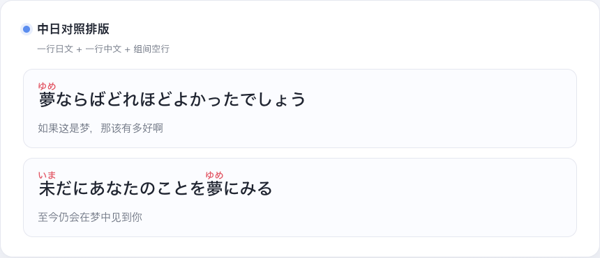
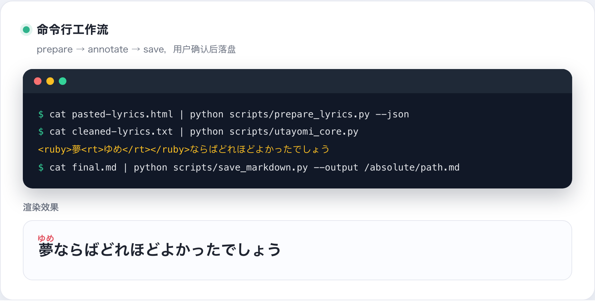
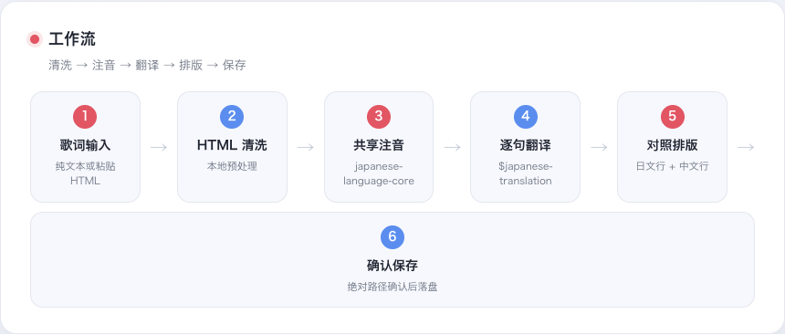
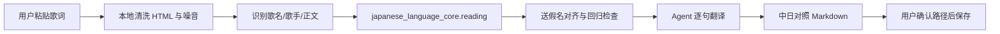
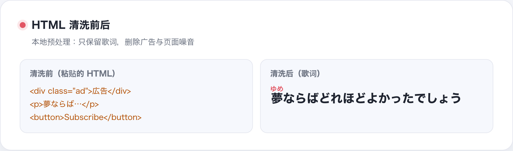
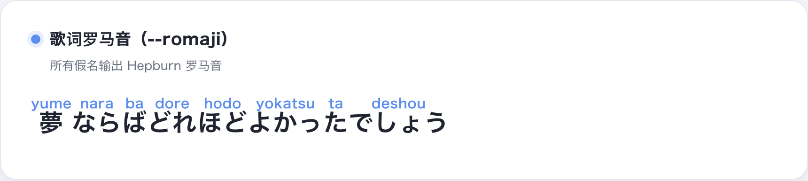
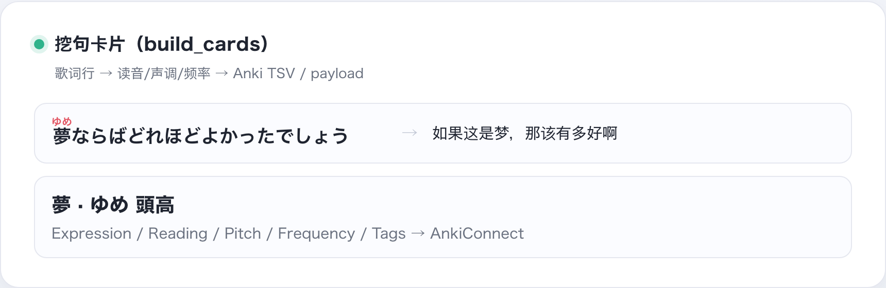

<div align="center">

# Utayomi

**[English](README.md) | [简体中文](README.zh-CN.md) | [日本語](README.ja.md)**

<p align="center">
  
</p>

<p align="center"><b>面向 Agent 的可审计日语歌词注音与翻译 Skill</b></p>

<p align="center">把确定性的日语读音处理交给本地引擎，把清洗、翻译和排版交给 Agent。</p>

</div>

Utayomi 不是让大模型凭感觉给歌词里的汉字猜读音，而是把歌词处理拆成可以检查的阶段：

```text
用户提供的原文 → 本地清洗 → 日语词法与上下文读音 → Ruby 生成与回归检查 → Agent 翻译与排版 → 用户确认后保存
```

最终可以得到适合 Obsidian、Typora、浏览器和 Agent 对话窗口使用的 Markdown/HTML 振假名内容。

输出示例见 [`example/`](./example)。

## 我们究竟在解决什么问题？

日语歌词不是“把每个汉字查一个音”这么简单：

- 日语没有用空格稳定分隔词语，首先需要词法分析。
- 同一个汉字或词语会因为上下文、词性和活用而改变读音。
- 送假名不能被粗暴地包进 Ruby，例如 `歌う` 应该呈现为 `<ruby>歌<rt>うた</rt></ruby>う`。
- 歌词中的换行、重复副歌、括号、标点和页面复制噪音都需要分别处理。
- 词典中的候选读音是证据，不应该在没有上下文判断的情况下静默覆盖主引擎结果。

因此，Utayomi 的目标不是宣称“所有日语都 100% 正确”，而是让每一次处理都有明确的引擎、输入边界、校验规则和可复现的失败方式。

## 细致性体现在哪里？

| 层次 | 实现 | 为什么重要 |
| --- | --- | --- |
| 原文保真 | 所有 token 的 `orig` 拼接后必须等于输入 | 不吞掉换行、标点、空格或歌词字符 |
| 上下文读音 | 默认使用公开的 `japanese-language-core`（reading 能力），优先 Sudachi，必要时回退 PyKakasi | 先按词和上下文判断，再生成读音 |
| 送假名对齐 | 对日文片段中的假名运行进行对齐 | `踏み込む`、`歌う` 等不会简单整词包裹 |
| 词典证据 | 可接入 Yomitan/JMdict/JMnedict/KANJIDIC 数据 | 提供候选读音、词性、标签和审计信息，但不盲目替换 |
| 人工规则 | 每条覆盖规则有 ID、理由和测试样本 | 特殊短语可以被审阅、回归和撤销 |
| 输出校验 | 共享契约与本项目回归测试共同检查原文与 Ruby 输出 | 发现错误时报告，而不是把测试未覆盖的情况伪装成确定结果 |
| Agent 边界 | 本地清洗用户输入，不抓取外部歌词网页 | 降低网页噪音、来源不明和隐私泄露风险 |
| 文件安全 | CLI 默认只输出，不随机写文件或覆盖已有文件 | 文件生成和路径确认留在明确的 Agent 工作流中 |

## 一个实际例子

```text
输入：雨が降り止むまでは帰れない
```

共享引擎和审核规则输出：

```html
<ruby>雨<rt>あめ</rt></ruby>が<ruby>降<rt>ふ</rt></ruby>り<ruby>止<rt>や</rt></ruby>むまでは<ruby>帰<rt>かえ</rt></ruby>れない
```

这里的 `降り止む` 使用上下文读音，而不是把每个汉字交给一个孤立的逐字转换器。这个样本已经进入共享引擎的契约测试。

## 效果预览

GitHub 的 README 不渲染 `<ruby>` 标签，以下是真实歌词注音与排版效果的渲染图。

<p align="center">
  
  <br><sub>歌词注音：共享引擎的上下文读音，送假名保持在 ruby 外</sub>
</p>

<p align="center">
  
  <br><sub>中日对照排版：一行日文 + 一行中文 + 组间空行</sub>
</p>

<p align="center">
  
  <br><sub>命令行工作流：prepare → annotate → save，用户确认后落盘</sub>
</p>

<p align="center">
  
  <br><sub>工作流：歌词输入 → HTML 清洗 → 共享注音 → 逐句翻译 → 对照排版 → 确认保存</sub>
</p>

**日本語版 / English 版**：同一套七张图在 `screenshot/ja/` 与 `screenshot/en/`，
生成模板见 `scripts/screenshot/showcase.html`。

## 工程方法：证据、复现和可证伪

Utayomi 采用的是一套工程化的语言处理方法，而不是把“模型看起来很聪明”当成质量证明：

1. **上下文优先**：先进行词法分析，再从 token 生成读音；默认引擎是 Sudachi，上下文引擎不可用时才回退。
2. **证据分层**：Yomitan 及其词典数据用于候选、释义和差异审计；最终输出由上下文引擎和经过审核的规则决定。
3. **规则可审阅**：特殊读音不写成隐藏的模型提示，而是以有 ID、有理由、有测试的覆盖规则存在。
4. **不变量校验**：输入和输出之间保持原文可追溯关系；Ruby 不平衡或汉字遗漏时报告失败。
5. **标准答案回归**：人名、地名、多音字、活用、歌词式样本和长文本都进入可重复测试，而不是只测试一个漂亮示例。
6. **差异不被隐藏**：主引擎和词典候选不一致时进入报告。例如 `愛し` 的古语候选 `はし` 目前仍保留为人工复核项，没有被自动写入覆盖规则。
7. **版本可追踪**：Yomitan 快照保存 release 标识和 SHA-256；共享引擎有独立 distribution 元数据，两个应用使用同一份源代码。

该方法受到日语形态素解析和机器可读词典工作的启发，但本项目的测试结果属于项目级工程证据，不等同于学术论文中的独立基准评测，也不宣称所有文本都能得到完美读音。

## 工作流



### 输入整理

`prepare_lyrics.py` 只处理用户已经提供的文本：

- 删除 HTML 标签、`script`、`style` 等结构噪音。
- 解码 HTML 实体。
- 识别明确的歌曲名和歌手信息。
- 保留重复句、括号、和声标记和原始歌词换行。
- 不根据 URL 自动抓取歌词，也不把外部网页当作数据来源。

<p align="center">
  
  <br><sub>清洗前后：只保留歌词，删除广告与页面噪音</sub>
</p>

### 注音引擎

Utayomi 通过独立的 `japanese-language-core` 包消费最小化的 `ReadingToken` 契约：

```python
from japanese_language_core.reading import create_engine

engine = create_engine("auto")
tokens = tuple(engine.tokens("雨が降り止む"))
assert "".join(token.orig for token in tokens) == "雨が降り止む"
```

引擎模式：

- `auto`：优先 Sudachi，上下文引擎不可用时回退 PyKakasi。
- `shared`：严格要求共享引擎，适合 CI 和生产检查。
- `legacy`：强制使用原有 Fugashi/PyKakasi 路径，用于兼容旧环境。

歌词翻译、标题识别和 Markdown 排版由 Utayomi 自己负责，普通学习文本的注音
工作流与之分离。

## 核心特性

- **平假名注音**：`<ruby>漢字<rt>かんじ</rt></ruby>`。
- **罗马音模式**：使用 `--romaji` 输出 Hepburn 罗马音。
- **上下文读音**：消费独立 `japanese-language-core` 的 Sudachi 优先共享引擎。
- **送假名处理**：尽量将汉字部分和假名部分分开标注。
- **HTML 清洗**：处理用户粘贴的纯文本或混杂 HTML 的内容。
- **中日对照排版**：每句日文之后放置对应中文翻译。
- **Agent 集成**：支持 Codex 等环境中的 Skill 工作流，也提供 `PROMPT.md` 作为降级方案。
- **本地优先**：注音脚本不需要上传歌词，不自动访问歌词网站。

<p align="center">
  
  <br><sub>罗马音模式（--romaji）：所有假名输出 Hepburn 罗马音</sub>
</p>

<p align="center">
  
  <br><sub>挖句卡片（build_cards）：歌词行 → 读音/声调/频率 → Anki</sub>
</p>

## 使用方法

### Agent 模式

安装并激活 Skill 后，可以这样使用：

```text
utayomi 帮我处理下面这段歌词：
星空
示例歌手
静かな夜に星を見上げる
```

建议的输入结构是：第 1 行歌曲名，第 2 行歌手名，第 3 行开始为歌词正文。信息不足时，Skill 不会擅自补全歌名或歌手。

如果输入中包含 HTML：

```text
utayomi 请清理下面这段用户粘贴的 HTML，只保留歌词并完成注音和翻译：
<article>
  <h1>歌曲名：星空</h1>
  <p>歌手：示例歌手</p>
  <p>静かな夜に<br>星を見上げる</p>
</article>
```

### CLI 模式

推荐使用已经安装共享依赖的虚拟环境；不要默认使用没有依赖的裸 `python3`：

```bash
# 两个仓库位于同一个本地工作区时
printf '%s\n' '夢ならばどれほどよかったでしょう' | \
  PYTHONPATH=/path/to/japanese-language-core/src /path/to/python \
  scripts/utayomi_core.py --engine shared

# 罗马音模式
printf '%s\n' '夢ならばどれほどよかったでしょう' | \
  PYTHONPATH=/path/to/japanese-language-core/src /path/to/python \
  scripts/utayomi_core.py --engine shared --romaji

# 清洗用户粘贴的 HTML，并查看结构化结果
cat pasted-lyrics.txt | .venv/bin/python scripts/prepare_lyrics.py --json
```

CLI 只负责清洗或注音并输出结果，不负责翻译，也不在随机目录写文件。保存 Markdown 文件属于 Agent 工作流，
必须先得到用户确认的完整绝对路径，再使用安全保存脚本：

```bash
cat final.md | .venv/bin/python scripts/save_markdown.py \
  --output /absolute/path/confirmed-lyrics.md
```

只有用户明确允许时，才追加 `--create-parent` 或 `--overwrite`。

## 安装

### 推荐：使用独立共享引擎

```bash
python3 -m venv .venv
.venv/bin/python -m pip install -r requirements.txt
.venv/bin/python -m pip install -r requirements.txt
```

安装完成后，如果共享包已经进入当前虚拟环境，可以省略 `PYTHONPATH`；本地联调时也可以执行
`.venv/bin/python -m pip install -e /path/to/japanese-language-core`。

### 兼容旧版环境

如果暂时没有共享引擎，可以先安装 `requirements.txt`，再显式使用：

```bash
printf '%s\n' '夢ならばどれほどよかったでしょう' | \
  .venv/bin/python scripts/utayomi_core.py --engine legacy
```

旧版模式只用于兼容和对比；新项目建议使用 `auto` 或严格的 `shared`。

### 安装为 Codex Skill

Release 包必须包含完整目录，而不是只复制 `SKILL.md`，因为 Skill 依赖其中的本地脚本和资源：

```text
将完整的 Utayomi 项目安装到你的 Codex Skill 目录，并激活其中的 SKILL.md。
```

安装后新建会话进行触发测试，确认歌词工作流与普通学习文本注音工作流互不干扰。

也可以把下面的提示发送给 Agent，请它根据当前环境完成安装；安装后仍应检查完整 Skill 目录和本地 Python 依赖：

```text
请学习并访问 https://github.com/qweihu/Utayomi ，将完整项目安装并激活为本地 Skill，名称为 utayomi。
安装完成后，请告诉我 Skill 的完整路径以及下一步使用示例。
```

## 可重复验证

当前本地验证结果：

- Utayomi 测试：19/19 通过。
- 本仓库测试：19/19 通过。
- Skill 结构校验：通过。
- 真实 Codex 新会话：歌词注音工作流与共享引擎契约均已验证。
- 共享引擎契约：覆盖 `降り止む`、重复送假名、legacy 转义、CLI 原文保留和 `auto/shared/legacy` 边界。

运行 Utayomi 测试：

```bash
PYTHONPATH=/path/to/japanese-language-core/src /path/to/python \
  -m unittest discover -s tests -v
```

共享引擎边界说明见 japanese-language-core 仓库的文档。

## 当前边界

Utayomi 当前有意不做以下事情：

- 不自动抓取歌词网站或根据 URL 猜测歌词来源。
- 不把 Agent 的翻译结果伪装成词典或语言学标注结果。
- 不在没有上下文证据时自动写入有争议的读音覆盖规则。
- 不承诺所有人名、古语、歌词化表达和方言读音都能一次正确处理。
- 不把本地生产审计描述为 OpenAI 官方认证或学术基准评测。

遇到不确定读音时，正确做法是保留证据、输出差异并补充经过审核的测试样本，而不是隐藏不确定性。

## 方法依据与数据来源

本项目的技术路线参考了以下一手资料：

- [Sudachi: a Japanese Tokenizer for Business](https://aclanthology.org/L18-1355/)：日语词法分析和多粒度分词的基础参考。
- [JMdict Project](https://www.jmdict.org/jmdict/j_jmdict.html)：以日语为枢纽的多语言机器可读词典。
- [EDRDG 项目说明](https://www.jmdict.org/)：JMdict、JMnedict 和 KANJIDIC 系列数据的维护与许可信息。
- [KANJIDIC Documentation](https://kanjixml.sourceforge.net/kanjidic_doc.html)：单字读音、意义和属性信息的格式参考。

这些资料支持“词法分析、词典证据、人工审核和可复现验证”的工程分层；它们不是本项目准确率的背书。项目自身的质量判断仍然依赖版本化数据、标准答案、失败报告和回归测试。

## 项目结构

```text
utayomi/
├── scripts/
│   ├── prepare_lyrics.py  # 本地清洗 HTML、提取歌名和歌手
│   ├── save_markdown.py   # 用户确认路径后的安全保存
│   ├── run_tests.py       # 选择可用虚拟环境运行 Python 测试
│   └── utayomi_core.py    # 注音 CLI，共享引擎适配和 Ruby 输出
├── tests/
│   ├── test_prepare_lyrics.py
│   ├── test_export.py
│   └── test_shared_engine.py
├── screenshot/            # README 配图
├── example/               # 输出示例
├── SKILL.md               # Agent 工作流说明
├── PROMPT.md              # 无本地 Skill 时的降级提示词
├── requirements.txt       # 旧版兼容依赖
├── package.json
├── LICENSE
└── README.md
```

## License

MIT
